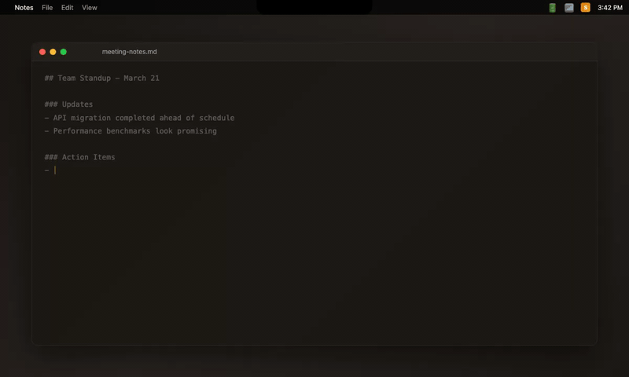

# Sotto

**Local voice control for macOS.** Push-to-talk dictation and 30+ system commands, powered by Whisper AI running entirely on-device.

No cloud. No latency. No data leaves your Mac.

<p align="center">
  
</p>

<p align="center">
  
  
  
  
  
  
</p>

---

## How It Works

Press a hotkey. Speak. Press again. Sotto transcribes your speech locally using [faster-whisper](https://github.com/SYSTRAN/faster-whisper) (CTranslate2), classifies the intent with sub-millisecond regex parsing, and either types the text at your cursor or executes a system command.

The entire pipeline runs locally with no network calls.

```
User presses Cmd+Shift+S
        ↓
Tauri → stdin JSON → Python sidecar
        ↓
sounddevice captures audio → streams levels back as JSON
        ↓
React pill renders real-time waveform
        ↓
User presses Cmd+Shift+S again
        ↓
faster-whisper transcribes → Intent Parser → Executor
                                                ↓
                                      pynput keyboard / AppleScript
```

## Features

- **Push-to-talk** with global hotkey (`Cmd+Shift+S`)
- **30+ voice commands**: app control, volume, brightness, clipboard, tabs, search
- **Dictation**: speak naturally, text appears at your cursor
- **Pill overlay**: minimal floating UI shows recording state and live waveform
- **System tray app**: lives in the menubar, no Dock icon
- **Settings window**: configure model, hotkey, and preferences via native UI
- **Metal GPU acceleration** on Apple Silicon via CTranslate2
- **Multiple Whisper models**: tiny, base, small, medium, large-v3

## Architecture

Sotto is a Tauri v2 app with a Python sidecar for audio and AI processing.

```
sotto-ui/                        # Tauri v2 application
├── src-tauri/
│   ├── src/
│   │   ├── main.rs              # Tauri entry point
│   │   ├── lib.rs               # App setup, window management, system tray
│   │   └── sidecar.rs           # Spawn & communicate with Python process
│   └── tauri.conf.json          # Window config, permissions, sidecar bundle
│
├── src/
│   ├── pill/                    # Floating pill overlay (recording UI + waveform)
│   ├── settings/                # Settings window (model, hotkey, preferences)
│   ├── components/              # Shared React components
│   └── lib/                     # Utilities, IPC helpers, types
│
sotto/                           # Python sidecar (audio + AI engine)
├── core/
│   ├── audio.py                 # Mic capture (sounddevice, 16kHz/512 blocks)
│   ├── transcriber.py           # faster-whisper with lazy model loading
│   ├── command_parser.py        # Compiled regex intent classifier
│   └── executor.py              # pynput keyboard sim + AppleScript
└── main.py                      # Sidecar entry point (stdin/stdout JSON IPC)
```

### IPC Model

Tauri spawns the Python engine as a sidecar process (bundled via PyInstaller). Communication is stdin/stdout JSON messages:

| Direction | Message | Purpose |
|-----------|---------|---------|
| Tauri → Python | `start_recording` | Begin audio capture |
| Python → Tauri | `audio_level` | Real-time mic levels for waveform |
| Tauri → Python | `stop_recording` | Stop capture, run transcription |
| Python → Tauri | `transcription` | Final text result |
| Python → Tauri | `status` | Engine state changes |

### Design Decisions

| Decision | Rationale |
|----------|-----------|
| Tauri v2 over Electron | Tiny binary, native webview, Rust performance |
| Python sidecar over native Rust audio | Leverage mature `faster-whisper` + `sounddevice` ecosystem |
| stdin/stdout JSON over HTTP/WebSocket | Simplest IPC, no port management, process lifecycle tied to app |
| `faster-whisper` over `openai-whisper` | 4x faster inference, lower memory, CTranslate2 backend |
| Regex parsing over ML classifier | Sub-millisecond, deterministic, no model loading overhead |
| `pynput` for keyboard simulation | Cross-app text injection without clipboard pollution |

## Quick Start

### Prerequisites

- Python 3.11+
- Rust (via [rustup](https://rustup.rs))
- pnpm
- portaudio (`brew install portaudio` on macOS)

### Quick Setup

```bash
git clone https://github.com/vedantggwp/Sotto.git
cd Sotto
bash scripts/setup.sh
cd sotto-ui && pnpm tauri dev
```

### Manual Setup

```bash
git clone https://github.com/vedantggwp/Sotto.git
cd Sotto

# Python setup
python -m venv venv
source venv/bin/activate
pip install -e ".[dev]"

# Build sidecar binary
pip install pyinstaller
bash scripts/build_sidecar.sh

# Frontend setup
cd sotto-ui
pnpm install

# Run in development mode
pnpm tauri dev
```

**Production build:**

```bash
cd sotto-ui
pnpm tauri build
# Output: src-tauri/target/release/bundle/macos/Sotto.app
```

**CLI mode** (run the Python engine standalone, no UI):

```bash
source venv/bin/activate
python -m sotto.main --cli
```

**Default hotkey:** `Cmd+Shift+S`

### macOS Permissions

Sotto requires two permissions in **System Settings > Privacy & Security**:

| Permission | Why |
|-----------|-----|
| Accessibility | Global hotkey capture + keyboard simulation |
| Microphone | Audio recording |

## Voice Commands

### App Control
```
"open Safari"          "quit Slack"           "switch to Finder"
```

### System
```
"volume up/down"       "mute" / "unmute"      "volume 50"
"brightness up/down"   "screenshot"           "lock screen"
```

### Text Editing
```
"copy" / "paste" / "cut"    "undo" / "redo"       "select all"
"delete that"               "new line"            "new paragraph"
```

### Navigation
```
"scroll up/down"       "go back/forward"      "new tab" / "close tab"
```

### Search
```
"search [query]"       → Spotlight
"google [query]"       → Default browser
```

## Configuration

Config: `~/.sotto/config.yaml` | Logs: `~/.sotto/logs/sotto.log`

```yaml
mode: push_to_talk

hotkeys:
  push_to_talk: "<cmd>+<shift>+s"

transcription:
  model: small.en
  language: en
  device: auto

feedback:
  overlay_enabled: true
  sound_enabled: true
```

## Tech Stack

| Layer | Technology |
|-------|-----------|
| Desktop shell | [Tauri v2](https://v2.tauri.app/) (Rust) |
| Frontend | [React 19](https://react.dev/) + TypeScript |
| Styling | [Tailwind CSS v4](https://tailwindcss.com/) |
| Speech-to-text | [faster-whisper](https://github.com/SYSTRAN/faster-whisper) (CTranslate2) |
| Audio capture | [sounddevice](https://github.com/spatialaudio/python-sounddevice) (PortAudio) |
| Keyboard control | [pynput](https://github.com/moses-palmer/pynput) |
| Config | [Pydantic](https://github.com/pydantic/pydantic) + YAML |
| Sidecar bundling | [PyInstaller](https://pyinstaller.org/) |

## Development

```bash
cd sotto-ui
pnpm tauri dev              # Dev mode with hot reload
pnpm tauri build            # Production build
```

```bash
source venv/bin/activate
python -m sotto.main --cli --debug   # CLI with debug output
pytest tests/                        # Run tests
ruff check .                         # Lint
```

### Adding Commands

1. Add a regex pattern to `COMMAND_PATTERNS` in `sotto/core/command_parser.py`
2. Add a handler method to `CommandExecutor._handlers` in `sotto/core/executor.py`

## Troubleshooting

**Hotkey not responding:** Grant Accessibility permission to Sotto.app (or your terminal in dev mode), then restart.

**No audio captured:** Grant Microphone permission. If already granted, remove and re-add the permission entry.

**Low accuracy:** Use a larger model (`small.en` or `medium.en` in settings). Reduce background noise.

**Sidecar not starting:** Ensure `scripts/build_sidecar.sh` completed successfully and the binary exists in `sotto-ui/src-tauri/binaries/`.

## License

MIT
